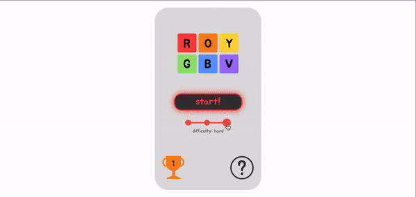

# 🐌 welcome! 🌱

    💻 Here are some of the things I've worked on...

<table>
    <tr bgcolor="#191919">
        <td width="100%">
            <h3 align="center">ROYGBV</h3>
            

            
<em>React, CSS, MongoDB, Netlify</em>

                
            
An online, hyper-casual, minimalistic color memory game made with React and Netlify functions. Features a serverless global leaderboard system. Click on the badge below to check out the game:

            
        </td>
    </tr>
</table>

    📮 Let's get in touch

