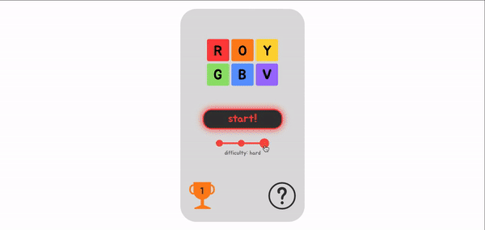
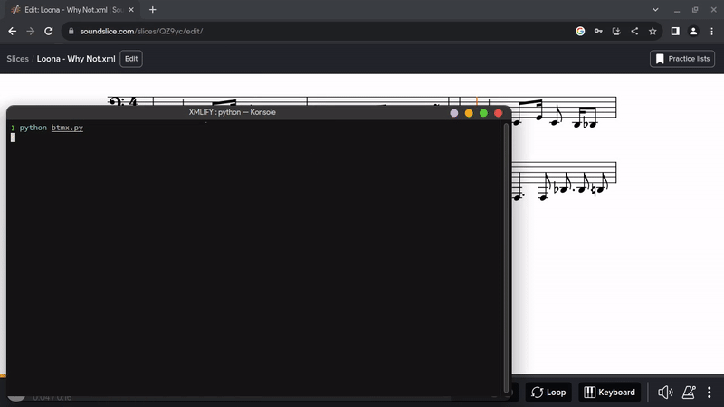
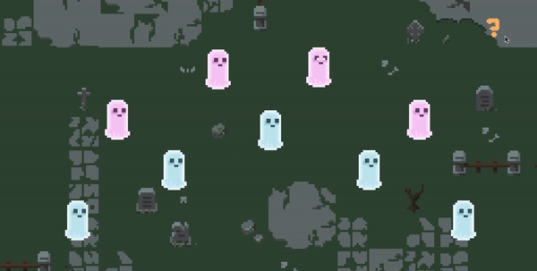

##### Tech Stack

<h3 align="center">Projects</h3>

  <table>
  <tr>
      <td width="100%" colspan=2>
        <h3 align="center">ROYGBV</h3>
        

          
<em>React, CSS, MongoDB, Netlify</em>

            
          
An online, hyper-casual, minimalistic color memory game made with React and Netlify functions. Features a serverless global leaderboard system. Also playable on mobile devices.

        
      </td>
      <!-- <td width="50%">
        <h3 align="center">Cebu Gluta Supplier</h3>
        <em>React, CSS, Netlify</em>
          

            
          

          
A responsive React website made for a local beauty product supplier. Features a product catalog to browse through, and Facebook Messenger integration to allow for direct communication with the supplier.

      </td> -->
    </tr>
    <tr>
      <td width="50%">
        <h3 align="center">BTMX: Bass Tabs to MusicXML</h3>
<!--         
 -->
          <em>Python</em>
            
          
A lightweight Python program that can generate MusicXML files from text-based bass guitar tablature.

        
      </td>
      <td width="50%">
        <h3 align="center">Cebu Gluta Supplier</h3>
        <em>React, CSS, Netlify</em>
          

            
          

          
A responsive React website made for a local beauty product supplier. Features a product catalog to browse through, and Facebook Messenger integration to allow for direct communication with the supplier.

      </td>
    </tr>
    <tr>
      <td width="50%">
        <h3 align="center">JBCT Lyfstyle Company Page</h3>
<!--         
 -->
          <em>HTML, CSS</em>
            
          
A responsive website made with HTML and CSS for an herbal supplement company - JBCT Lyfstyle. Features a landing page, a product page, and a login page for company members to access their dashboard.

        
      </td>
      <td width="50%">
        <h3 align="center">Ghosts Like To Sing</h3>
        <em>Godot, Netlify</em>
          

            
          

          
A small browser game made using Godot where you control a choir of ghosts using your keyboard. Hosted on Netlify.

          
      </td>
    </tr>
  </table>

###### I'm looking for work! Connect with me:

